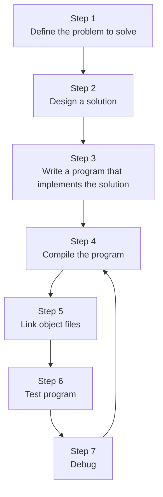

Programming languages use ascii. EX. ≠ is not in ascii and is represented by != in code.

---
File structure does not have rules however it is standard practice to name the primary/first source file `main.cpp`

