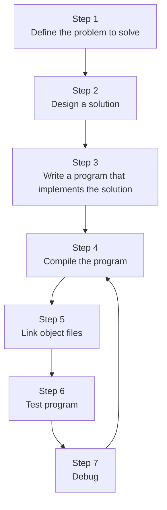

In order to compile c++ code, we use a compiler. It sequentuall ygoes through each source code (.cpp) file and does:

	1: Makes sure it followes rules of cpp language. if not compiler gives error

	2: Translates cpp code into machine lanugage instructions. These instructions   are stored in an intermediate file called an **object file**.

**Object Files** named name.io or name.obj. where the name is the same name as the .cpp file it was produced from

ex.
![[Pasted image 20260817125540.png|384]]

---
after compiler is finished, a **linker** kicks in. Its job is to combine all of the object files and produce the desired output file, like an .exe you can run. This process is called **linking**.  If any step in the linking process fails the linker will generate an error message then abort.

1. The linker reads each obj file generated by the compiler and makes sure they are valid.
2. linker ensures all cross-file dependencies are resolved properly. EX. if you define something in one .cpp file, and us it in another cpp file, the linker will connect them together.
3. linker typically will link in one or more library files. which are collections of precompiled code that have been packaged up for reuse in other programs.
4. outputs the desired output file. typically an exe.

![[Pasted image 20260817130535.png|492]]

---
## Standard Library

c++ comes with c++ Standard Library. Most common is the input/output lib called **`iostream`**, which contains functionality for printing text on a monitor and getting keyboard input from a user

### Third Party Libraries
Libraries created by independent people. EX. you want a program that plays sounds. Standard lib contains no such functionality. You could write your own code that does this or you can import a library that already does this for you.

---
## Building
The term `building` is used to refer to the full process of converting source code files into an exe that can be run.

---
## Debugging & Testing
`Testing` is the process of addressing if your program is working as expected. 
`Debugging` is the process of finding and fixing programming errors found from testing

